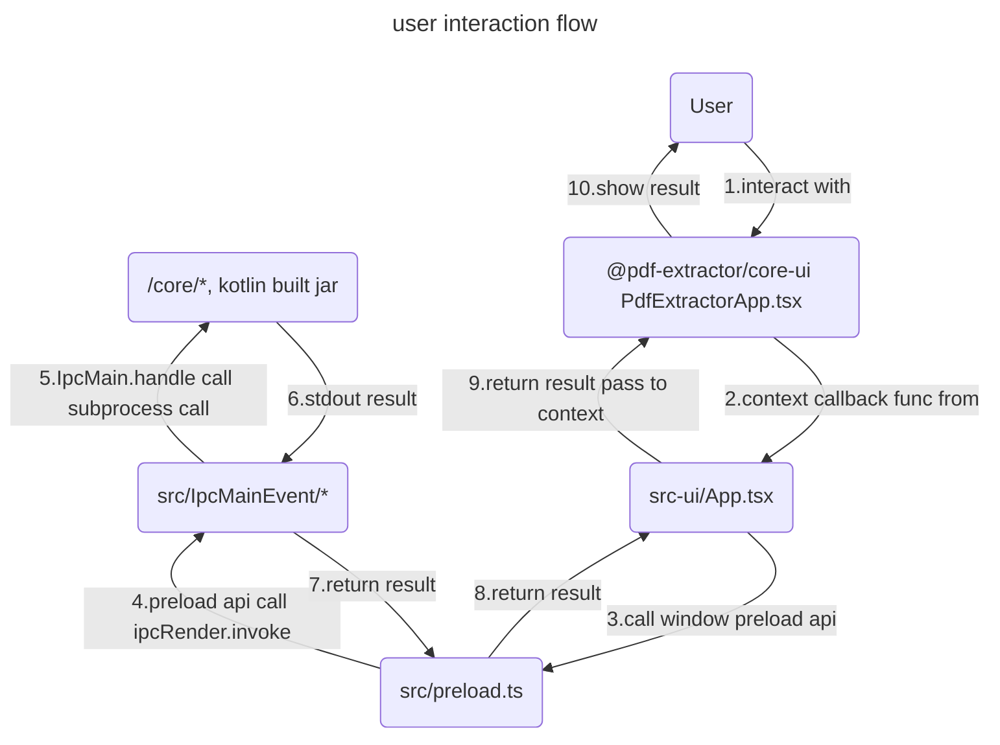

```mermaid
---
title: user interaction flow
---
flowchart BT
  preload("src/preload.ts")
  ipcMain("src/IpcMainEvent/*")
  jar("<repo_root>/core/*, kotlin built jar")
  srcUIApp("src-ui/App.tsx")
  pdfExtractorApp("@pdf-extractor/core-ui PdfExtractorApp.tsx")
  user("User")

  user--"1.interact with"-->pdfExtractorApp
  pdfExtractorApp--"2.context callback func from"-->srcUIApp
  srcUIApp--"3.call window preload api"-->preload
  preload--"4.preload api call ipcRender.invoke"-->ipcMain
  ipcMain--"5.IpcMain.handle call subprocess call"-->jar
  jar--"6.stdout result"-->ipcMain
  ipcMain--"7.return result"-->preload
  preload--"8.return result"-->srcUIApp
  srcUIApp--"9.return result pass to context"-->pdfExtractorApp
  pdfExtractorApp--"10.show result"-->user
```
